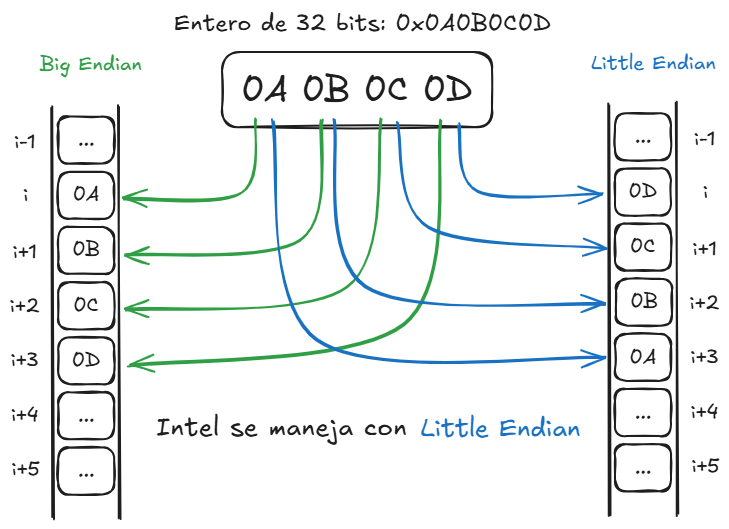
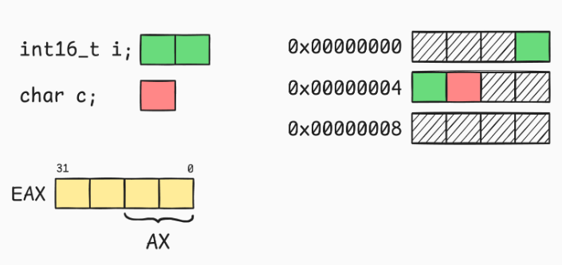
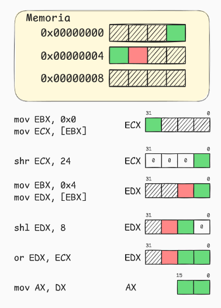
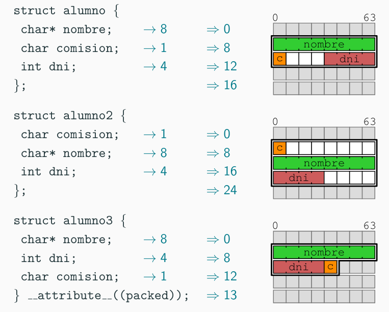
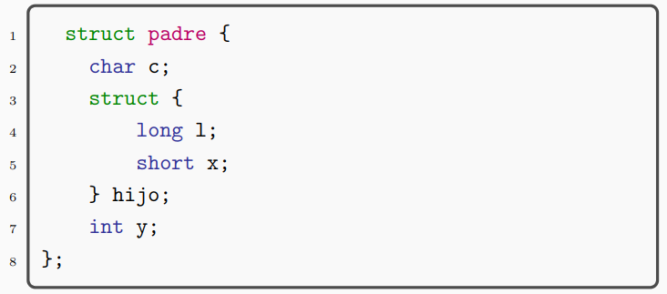

# Alineación

El hardware está diseñado para manipular una cantidad de bits por operación. A esta cantidad de bits la llamamos palabra (word), no es lo mismo que el tamaño direccionable en memoria (byte) y varía con el procesador. En general el procesador es más eficiente al trabajar con lecturas y escrituras de tamaño palabra o múltiplos. Por eso, la alineación que tengan los datos en memoria es importante para el rendimiento.

Vamos a ver un ejemplo, pero antes repasemos el concepto de endianness. Cuando queremos almacenar en memoria un dato que es más grande que una unidad direccionable (en nuestro caso, más de un byte), debemos establecer en qué orden se almacenarán esos bytes. Esto es lo que se conoce como `Endianness`. Podemos establecer que cuanto menos significativo sea un byte, más baja será la dirección de memoria en la que se encuentre (Little Endian), o bien, lo contrario (Big Endian). Esto es algo definido a nivel de hardware, pero es necesario saberlo para poder interpretar correctamente los valores que observemos directamente en la memoria. En el caso de Intel, se utiliza Little Endian.



Cuando el procesador realiza lecturas de memoria, es posible que lea más de lo indicado por la instrucción para aprovechar el ancho del bus, apoyándose en la idea de que si se requiere el valor de una posición de memoria, es probable que se requieran las posiciones cercanas también. Además, no hay garantía de que la primer posición leída sea la solicitada, sino que leerá un bloque que contenga la dirección requerida, pero que esté alineado con el tamaño de palabra o un múltiplo del mismo. Supongamos que el tamaño de ese bloque es de 4 bytes, tenemos dos variables almacenadas como se muestra en la imagen, y queremos cargar el valor de `i` en AX.



Al haber quedado los bytes de `i` en bloques distintos, el procesador deberá realizar dos lecturas para obtener el valor completo y luego acomodarlo para copiarlo en el registro deseado. Se puede tomar el siguiente código de ASM como la serie de pasos a ser llevados a cabo por el procedador de forma implícita (imaginando que se trata de un sistema con direccionamiento a 4 bytes en vez de a 1 byte).



Esto es perfectamente evitable si nos preocupamos por la alineación de las variables. Cada tipo de dato tiene su propio requerimiento de alineación, debe estar alieado a su tamaño. Por ejemplo, un entero de 32 bits debe estar alineado a 4 bytes.

Observemos el siguiente caso particular. ¿Cómo hacemos para que cada variable esté alineada como corresponde?


Simplemente forzamos la alineación de cada una, dejando posiciones en blanco entre ellas donde sea necesario, a las que llamamos padding.


Se sacrifica memoria para reducir el tiempo de ejecución.

# Estructuras en memoria

Así como vimos los contratos de función y uso de registros, tenemos un *contrato de datos* que especifica cómo deben estar alineados los atributos de un struct de forma que sea compatible con C. El contrato dice así:

- Cada atributo estará alineado al tamaño de su tipo de dato, insertando padding entre ellos en caso de ser necesario.
- La estructura en sí se alineará al tamaño del tipo más grande de sus atributos.
- El tamaño de la estructura será tal que la siguiente dirección de memoria estará alineada igual que la estructura, añadiendo padding al final de ella de ser necesario para que se cumpla. Pensar como en un "array de estructuras", una al lado de la otra en memoria. Entonces, el padding que se agrega al final de la estructura es el que se necesita para que la siguiente estructura esté alineada correctamente. Esto es importante porque si no se respeta, al acceder a la siguiente estructura, el procesador deberá realizar lecturas adicionales para obtener el valor completo, como en el caso de las variables desalineadas.

¡Ojo! No confundir tamaño del struct (resultado de `sizeof()`) con su requisito de alineación.

Veamos algunos ejemplos:



Observen cómo varía el tamaño de estas estructuras según el orden en que se definen sus atributos, a pesar de ser conceptualmente idénticas. Notarán que, además, el tercer caso no respeta el contrato de datos y no está alineado. A este tipo de estructuras se las denomina *empaquetadas* y se le indica al compilador agregando `__attribute__((packed))` al final de la declaración. Esta opción permite tener structs sin padding, para optimizar el tamaño a costa del tiempo de procesamiento que requerirán las lecturas.

¿Cómo afecta que un atributo del struct sea un array?


Si bien el array es el atributo más grande, lo que importa es el tamaño del tipo más grande de sus atributos. El array es de tipo `char`, que ocupa un byte, y por lo tanto el atributo con el tipo más grande es `elo`, que por ser `long` ocupa 8 bytes. Luego, el tamaño de la estructura es 40 bytes (8 + 21 + 3 (padding) + 4 + 4 (padding)), pero su requisito de alineación es de 8 bytes.

¿Cómo afecta que un atributo del struct sea un struct?



Para este caso, se tiene en cuenta el requisito de alineación del struct interno (en el ejemplo llamado `hijo`) como el tamaño del "tipo" del struct interno. En este caso, tener al atributo `hijo` como un struct, es equivalente a tener un `long` en su lugar, en lo que respecta a las reglas de alineación. Entonces, el tamaño de esta estructura es 32 bytes (1 + 7(padding) + 16(`sizeof(hijo)`) + 4 + 4(padding)).

Si encuentran otro caso que les genere duda, recuerden que pueden hacer un código de prueba en el que declaran el struct y lo inspeccionan con GDB.

# Ejercicios

Pongamos en práctica lo que acabamos de ver. Vamos a usar dos estructuras muy similares a lista\char_t de la clase anterior y vamos a implementar en ASM la función que contaba la cantidad total de elementos de la lista, para ambas estructuras. Pueden encontrar el código necesario en `Estructuras.c` y `Estructuras.asm`.
Las definiciones de las estructuras las pueden encontrar en el archivo `Estructuras.h`.

Programen en assembly las funciones:

``` C
uint32_t cantidad_total_de_elementos(lista_t* lista)

uint32_t cantidad_total_de_elementos_packed(packed_lista_t* lista)
```

El archivo que tienen que editar es `Estructuras.asm`. Para todas las declaraciones de las funciones en ASM van a encontrar la firma de la función. Completar para cada parámetro en qué registro o posición de la pila se encuentra cada uno.