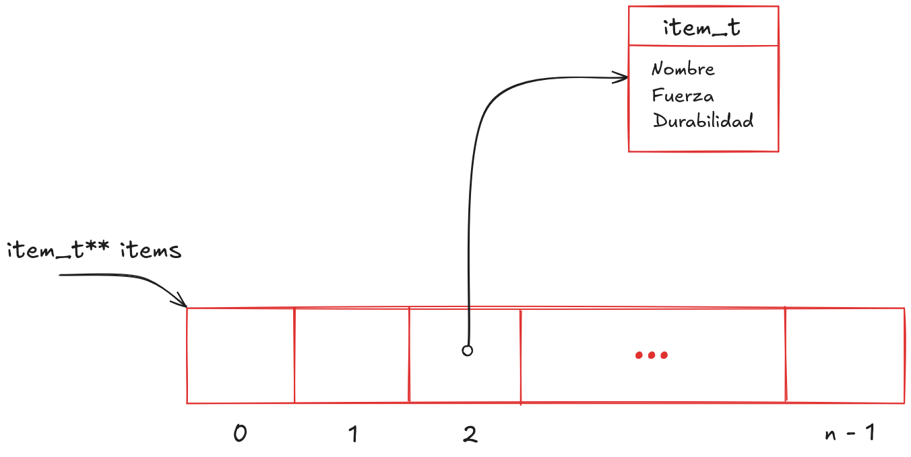

# Primer parcial - Arquitectura y Organización de Computadoras
#### Segundo cuatrimestre 2024

## Normas generales y modalidad de entrega

- El parcial es **INDIVIDUAL**
- Una vez terminada la evaluación se deberá crear un PR a `main` con la branch con la resolución como source.

## Régimen de Aprobación

- Para aprobar el examen es necesario obtener como mínimo **un ejercicio
  aprobado y un ejercicio regular**.
- Para conservar la posibilidad de promocionar es condición necesaria obtener
  como mínimo **dos ejercicios aprobados**, _sólo se aceptarán errores
  menores_.

## Actualización del fork individual

Es importante que, para esta instancia de parcial y próximas, **no creen un nuevo fork de este repositorio** si no que actualicen el mismo fork individual que estaban utilizando para el tp0.

Los pasos para actualizar el repositorio son los mismos que siguieron para el TP1-b y TP1-c, pero ante cualquier duda pueden consultarlos en el archivo [como_actualizar.md (link)](https://git.exactas.uba.ar/ayoc-doc/individual-2c2024/-/blob/master/p1/como_actualizar.md) de esta carpeta.

## Compilación y Testeo

Para compilar y ejecutar los tests cada ejercicio dispone de un archivo
`Makefile` con los siguientes *targets*:

| Comando             | Descripción                                                         |
| ------------------- | ------------------------------------------------------------------- |
| `make test_c`       | Genera el ejecutable usando la implementación en C del ejercicio.   |
| `make test_asm`     | Genera el ejecutable usando la implementación en ASM del ejercicio. |
| `make test_abi`     | Genera usando la implementación en ASM del ejercicio + archivos necesarios para ABI enforcer |
| `make run_c`        | Corre los tests usando la implementación en C.                      |
| `make run_asm`      | Corre los tests usando la implementación en ASM.                    |
| `make run_abi`      | Corre los tests usando la implementación en ASM + ABI enforcer.     |
| `make valgrind_c`   | Corre los tests en valgrind usando la implementación en C.          |
| `make valgrind_asm` | Corre los tests en valgrind usando la implementación en ASM.        |
| `make valgrind_abi` | Corre los tests en valgrind usando la implementación en ASM + ABI enforcer        |
| `make clean`        | Borra todo archivo generado por el `Makefile`.                      |

El sistema de tests de este parcial **sólo correrá los tests que hayan marcado
como hechos**. Para esto deben modificar la variable `EJERCICIO_xx_HECHO`
correspondiente asignándole `true` (en C) ó `TRUE` (en ASM). `xx` es el inciso
en cuestión: `1A` o `1B`.

# Ejercicio 1

Como parte del espectacular juego AAA llamado "AyOC 2 - La venganza de los
punteros" estamos diseñando su sistema de inventario. Los jugadores pueden tener
grandes cantidades de ítems en sus inventarios y quieren poder reordenarlos con
total fluidez. Debido a estos requisitos de performance se solicita implementar
en ensamblador algunas funciones del sistema de manipulación de inventarios.

La estructura utilizada para representar ítems es la siguiente:
```c
typedef struct {
    char nombre[18];
    uint32_t fuerza;
    uint16_t durabilidad;
} item_t;
```

El inventario se implementa como un array de punteros a ítems. Nuevos ítems
siempre se agregan al final. La siguiente imagen ejemplifica el inventario:



Uno de los requisitos más importantes es el de poder ver los ítems _más
fuertes_/_con menos daño_/_más baratos_/etc en simultáneo. Para lograr esto el
juego mantiene una serie de índices que indican la permutación necesaria para
mostrar el inventario según cada criterio.

Supongamos entonces que queremos mostrar la vista de ítems según daño:
```c
items_danio[i] = inventario[indices_danio[i]];
```

Si en su lugar quisiéramos verlos ordenados por durabilidad:
```c
items_durabilidad[i] = inventario[indices_durabilidad[i]];
```

Estos índices nos permiten mantener múltiples nociones de orden en simultáneo sin tener que mantener múltiples copias de los inventarios (alcanza con mantener los índices).

Hay muchísimos criterios de orden posibles por lo que además definimos un tipo
de dato para poder hablar de ellos:
```c
typedef bool (*comparador_t)(item_t*, item_t*);
``` 

## 1A - Detectar índices ordenados

Las vistas del inventario son editables y nos gustaría poder detectar cuando una
vista es equivalente a ordenar el inventario según una función de comparación.
Esto permitiría ahorrar memoria representando esas vistas como "el resultado de
ordenar la lista usando X" en lugar de tener que escribir todo el índice.

Para realizar esto se solicita implementar en ensamblador una función que
verifique si una vista del inventario está correctamente ordenada de acuerdo a
un criterio. La firma de la función a implementar es la siguiente:
```c
bool es_indice_ordenado(item_t** inventario, uint16_t* indice, uint16_t tamanio, comparador_t comparador);
```

Dónde:
- `inventario`: Un array de punteros a ítems que representa el inventario a
  procesar.
- `indice`: El arreglo de índices en el inventario que representa la vista.
- `tamanio`: El tamaño del inventario (y de la vista).
- `comparador`: La función de comparación que a utilizar para verificar el
  orden.

Tenga en consideración:
- `tamanio` es un valor de 16 bits. La parte alta del registro en dónde viene
  como parámetro podría tener basura.
- `comparador` es una dirección de memoria a la que se debe saltar (vía `jmp` o
  `call`) para comenzar la ejecución de la subrutina en cuestión.
- Los tamaños de los arrays `inventario` e `indice` son ambos `tamanio`.
- `false` es el valor `0` y `true` es todo valor distinto de `0`.
- Importa que los ítems estén ordenados según el comparador. No hay necesidad
  de verificar que el orden sea estable.

## 1B - Materializar índices

Cuando una vista es muy importante para un jugador se puede escoger reordenar el
inventario en base a esta. Nuestros índices son básicamente una forma de
representar permutaciones del inventario. Se solicita implementar una función
que dado un inventario y una vista cree un nuevo inventario que mantenga el
orden descrito por la misma.

Es decir:
```math
\forall i \in [0; \text{tamanio})\quad  \text{resultado}[i] = \text{inventario}[\text{vista}[i]]
```

La memoria a solicitar para el nuevo inventario debe poder ser liberada
utilizando `free(ptr)`.

La función debe tener la siguiente firma:
```c
item_t** indice_a_inventario(item_t** inventario, uint16_t* indice, uint16_t tamanio);
``` 

Donde:
- `inventario` un array de punteros a ítems que representa el inventario a
  procesar.
- `indice` es el arreglo de índices en el inventario que representa la vista
  que vamos a usar para reorganizar el inventario.
- `tamanio` es el tamaño del inventario.

Tenga en consideración:
- Tanto los elementos de `inventario` como los del resultado son punteros a
  `ítems`. Se pide *copiar* estos punteros, **no se deben crear ni clonar
  ítems**