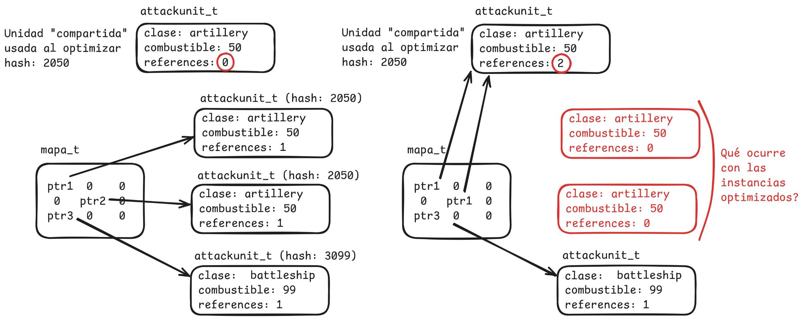

# Recuperatorio primer parcial - Arquitectura y Organización de Computadoras
#### Segundo cuatrimestre 2024

## Normas generales y modalidad de entrega

- El parcial es **INDIVIDUAL**
- Una vez terminada la evaluación se deberá crear un PR a `main` con la branch con la resolución como source.

## Compilación y Testeo

Para compilar y ejecutar los tests cada ejercicio dispone de un archivo
`Makefile` con los siguientes *targets*:

| Comando             | Descripción                                                         |
| ------------------- | ------------------------------------------------------------------- |
| `make test_c`       | Genera el ejecutable usando la implementación en C del ejercicio.   |
| `make test_asm`     | Genera el ejecutable usando la implementación en ASM del ejercicio. |
| `make test_abi`     | Genera usando la implementación en ASM del ejercicio + archivos necesarios para ABI enforcer |
| `make run_c`        | Corre los tests usando la implementación en C.                      |
| `make run_asm`      | Corre los tests usando la implementación en ASM.                    |
| `make run_abi`      | Corre los tests usando la implementación en ASM + ABI enforcer.     |
| `make valgrind_c`   | Corre los tests en valgrind usando la implementación en C.          |
| `make valgrind_asm` | Corre los tests en valgrind usando la implementación en ASM.        |
| `make valgrind_abi` | Corre los tests en valgrind usando la implementación en ASM + ABI enforcer        |
| `make clean`        | Borra todo archivo generado por el `Makefile`.                      |

El sistema de tests de este parcial **sólo correrá los tests que hayan marcado
como hechos**. Para esto deben modificar la variable `EJERCICIO_xx_HECHO`
correspondiente asignándole `true` (en C) ó `TRUE` (en ASM). `xx` es el inciso
en cuestión: `1A`, `1B`, `1C`.

# Ejercicio 1

Luego del éxito de nuestro último juego "AyOC - la venganza de los punteros" hemos decidido incursionar al mundo de los juegos de estrategia por turnos para nuestro próximo juego, "Organized Wars".

En su turno, el jugador podrá colocar en un mapa de juego cuadriculado varias unidades de ataque de distintas clases. Cada clase tiene un valor inicial de combustible cargado, el cuál utilizarán en una etapa posterior para realizar acciones como moverse, disparar bombas, etc. Además del combustible precargado, el jugador cuenta con una reserva extra de combustible que puede repartir entre las unidades que desee, potenciando ciertas unidades puntuales.

Dado que es común que los jugadores reposicionen y modifiquen los niveles de combustible de las unidades constantemente durante su turno, el sistema de nuestro juego funciona del siguiente modo:

- Durante el transcurso del turno, cada unidad de ataque agregada se instancia independientemente. 
- Al momento de finalizar el turno, se revisa que el jugador no haya asignado más combustible extra del que tenía disponible en su reserva. De haber asignado combustible correctamente, se efectiviza el final del turno.
- Una vez finalizado el turno, se corre una optimización que reemplaza todas las instancias independientes de unidades equivalentes por una única instancia "compartida"" (donde dos unidades son equivalentes si el resultado de aplicar una función de hash dada sobre cada una es el mismo).

**a)** Programar en lenguaje assembler una función que, dado el puntero a un personaje, "optimice" todas las unidades del mapa que sean
equivalentes utilizando en su lugar la versión pasada por parámetro. La solución debe hacer un uso apropiado
de la memoria, teniendo en cuenta que las referencias a unidades solo son guardadas en el mapa.

`void optimizar(mapa_t mapa, personaje_t* compartida, uint32_t *fun_hash)`

**b)** Programar en lenguaje assembler una función

`uint32_t contarCombustibleAsignado(mapa_t mapa, uint16_t (*fun_combustible)(char*))`

que se utilizará para calcular, antes de finalizar el turno del jugador, la cantidad de combustible **de la reserva** que fue asignado por el jugador. La funcion fun_combustible pasada por parametro, toma una clase de unidad y devuelve la cantidad de combustible base que le corresponde.

---

Luego de la optimización cominenza la fase de batalla, en la que las unidades realizarán acciones y sus niveles de combustible se modificarán de manera acorde. Si se modifica una unidad que está compartiendo instancia por una optimización, se debe crear una nueva instancia individual para esta en lugar de modificar la instancia compartida (lo cual resultaría en modificaciones indebidas en otras unidades).

**c)** Programar en lenguaje assembler una función
    
`void modificarUnidad(mapa_t mapa, uint8_t x, uint8_t y, void *fun_modificar)`

que dada una posición en el mapa permita aplicar la función modificadora a la unidad en esa posición **únicamente**. 
La solución propuesta debe tener en cuenta el caso en que se quiera modificar una unidad que previamente había sido optimizada, sin hacer uso excesivo o innecesario de recursos del sistema.

De no haber una unidad en la posición especificada, no se debe hacer nada.

---
**Observaciones:**

- La instancia compartida podría ser una **nueva instancia** o **alguna de las instancias individuales preexistentes**.
- En los tests se utiliza un area del mapa de 5x5 lugares para simplificar la visualización, pero se evaluará que se resuelva correctamente para el mapa completo.
- Para cada función se incluye un último test que sí trabaja sobre un mapa de tamaño máximo. Este test no correrá hasta que los anteriores pasen exitosamente.
- A fin de debuggear puede ser útil revisar la función de hash utilizada en los tests, la cual está definida al principio de `test.c`.